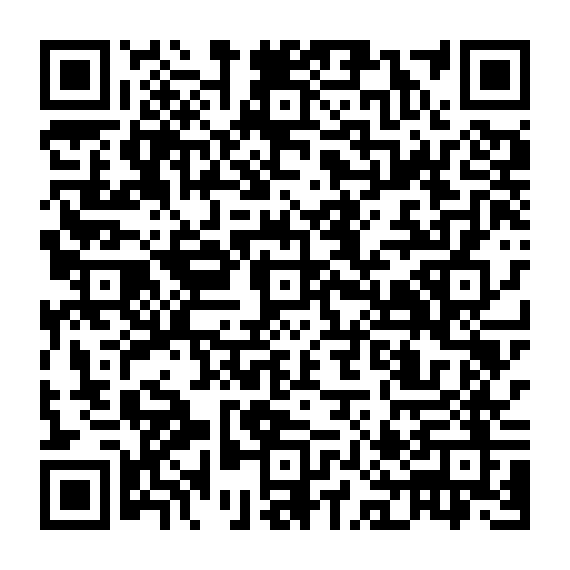
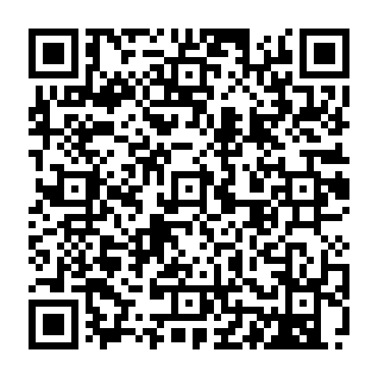

# YouTube source-behavior rewrite: R3

R2 failed the user's iPhone test: Home/below-video banners remained and locking
the screen stopped audio. This revision returns to the original script as an
analysis oracle, rather than treating a passing independent VM test as parity.

## Reference and reproducible differences

Analyzed `duyvinh09/Module_IOS/js/youtube.response.js` at immutable commit
`34865755c1aee7ba770c1afa364254d8924cfd85`, SHA-256
`5762e310cd546084f172828d827e16b1db36d1677a692c5de4f1a476c3bd89e6`.
The oracle is downloaded to `/tmp` only. It is never copied into our runtime or
committed/distributed. The test VM disables dynamic code generation, has no real
HTTP client, accepts synthetic fixtures only and uses temporary in-memory fake
storage. Translation is off in those tests. No real personal traffic is collected.

Running both implementations on identical fixtures reproduced these differences:

| Trigger | Original | R2 | R3 |
|---|---|---|---|
| Home typed ad, method/status absent | Removes ad | Skips entire response | Removes ad without claiming absent status means HTTP 200 |
| Canonical tracker inside a large opaque binary renderer | Removes ad | Cannot parse framing; keeps ad | Finds complete canonical ad URL inside that typed renderer |
| `account/get_setting` with category 10135 | Adds background renderer + client toggle 151 | No hook or handler | Adds background flag + same client toggle |
| Watch Next and Player in one response | Processes both | Separate narrow adapter | One hook processes player then Next |
| Shadowrocket binary body contract | Returns `body: Uint8Array` | Multiple body representations | Normalizes accepted byte representations to `body: Uint8Array` |

`native/v3/scripts/youtube-feed-r3.js` independently implements the missing
behavior. `native/v3/templates/youtube-response-r3.js.in` embeds the existing
player byte-for-byte and normalizes the response adapter. The original V2 player,
R2 sources/locks and production config remain immutable. The R3 generator checks
the original player SHA-256 and never writes a config.

Missing runtime metadata is accepted only on exact YouTube response routes with
valid bounded bytes. Explicit non-POST, known non-200, malformed status metadata
and conflicting status/statusCode still pass unchanged. A missing status is
logged as unknown; it is never reported as an observed HTTP 200.

Settings only add the background preference. Existing unknown fields and ordinary
settings are preserved; repeated processing is idempotent. We do not synthesize
the original's download/quality/smart-download/Premium icon flags. A client flag
is not a purchase or backend entitlement and does not prove iOS permits audio
while locked. Background rendering still needs the actual iPhone acceptance test.

Opaque classification requires a canonical ad URL inside the already typed
ad-candidate region. It intentionally does not reproduce the original's arbitrary
`pagead` substring deletion or persistent field/layout blacklist. Normal Shorts
are retained. Guide menu changes and caption/lyric translation are outside this
background/banner repair. This is scoped source comparison, not full script parity.

## Verification

```sh
python native/v3/tools/fetch_source_references.py
python native/v3/build_youtube_r3.py --check
node --test native/tests/*.test.cjs native/v2/tests/*.test.cjs native/v3/tests/*.test.cjs
python -m unittest discover -s native/v3/tests -p 'test_*.py' -v
```

The reference SHA-256 must match before execution. Cases compare Home, absent
metadata, raw opaque tracking, Watch, Settings, Next/Search/continuations directly
with the actual third-party script; other cases guard negative text/hosts,
unknown settings, ordinary Shorts, fixed-width unknown bytes, malformed siblings,
aggregate budgets, binary representations, callback count and diagnostic privacy.
These are offline Node VM tests. No actual iPhone run has been performed by Codex.

## Same installation URL and QR

https://raw.githubusercontent.com/Vcab3011/Khanh-Rocket/v3-test/build/khanh-rocket-v3-test.conf



R3 uses one YouTube response hook, with the new engine pinned to its reviewed
source commit. Other app hooks, routing, MITM and rewrite rules stay unchanged.
Refresh the same configuration, then close/reopen YouTube, refresh Home, open a
normal video and inspect its recommendations, then lock the screen to test audio.
The app can still display filename `khanh-rocket-v3-test.conf`; the text's `#!name`
is R3. There is no need to change subscription/config URL for each revision.

If an issue persists, share only `KR-YT response-r3` / `KR-YT feed-r3` summary
lines. Do not send raw HTTP bodies, auth headers, accounts, receipts or history.
Production main and Egern remain separate and unchanged; no PR is merged.

## SoundCloud follow-up and V1 QR

The user additionally reports SoundCloud ads. The current original module at
`5502a6febe84b7db635d3bd31749731aed5c057b/js/SoundCloudGoPlus.js`, SHA-256
`08421be74ff6ce5f4fc17714d92899a7765f1b0254b78246c58580d284cec05e`, produces
the exact same plan and all nine feature flags as our existing first-party
SoundCloud script on successful synthetic JSON. Unknown top-level values are
preserved equally. This includes `no_audio_ads=true` and `ads_krux=false`.
No missing rewrite behavior explaining the device ads was demonstrated. The
SoundCloud hook remains unchanged; invocation/response application and current
server-side ad behavior remain unresolved. No actual Go+ purchase is created.

The requested V1 QR is interpreted as the original 10in1 profile on main:

https://raw.githubusercontent.com/Vcab3011/Khanh-Rocket/main/build/khanh-rocket.conf



Both QR images were decoded independently to their exact respective existing
URLs. Main's config is unchanged. V1 is the historical third-party configuration,
not a newly verified implementation; its current device behavior is untested.
